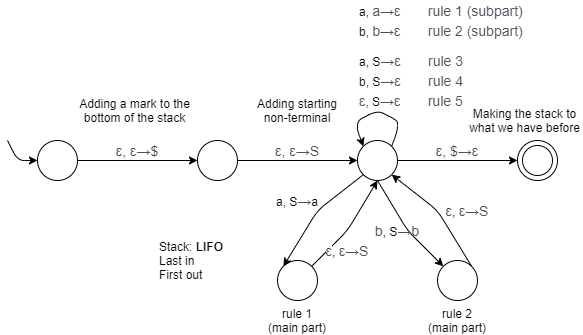

# Pushdown Automaton (PDA)
[](https://github.com/FaDrYL)
[](https://www.fadryl.com/)

It looks like a **NFA** with a **stack**.

PDA can be used to present CFG, also CFL.

<br/>

## Components
- Alphabet of input letters
- Alphabet of stack letters
- A set of states
  - One is start state
  - Some (or none) are final state
- Input tape
  - Read in one direction (left to right)
- Stack
  - Purpose of memory.
  - Two operations:
    1. Push (add to top of stack)
    2. Pop (remove from top of stack)
- A set of transitions
  - Format: `a, b -> c` (any of these can be empty `Ɛ`)
    - Read `a` from input tap.
    - If `b` on the top of stack, pop it out.
    - Then, push `c` to top of the stack.
    
<br/>

## Convert CFG To PDA
> Convert a CFG to PDA

The CFG of language PALINDROME we write before.

```
S -> aSa          (1)
S -> bSb          (2)
S -> a            (3)
S -> b            (4)
S -> Ɛ            (5) 
```

We can write a PDA for that:



