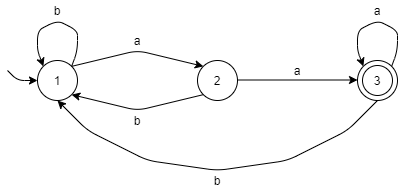
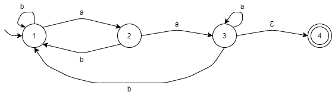
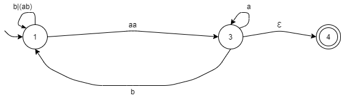

# Regular Language
[](https://github.com/FaDrYL)
[](https://www.fadryl.com/)

Regular language is a formal language that can be presented by [regular expression](#Regular-Expression-(RegEx)) and 
can be recognized by some [final automaton](#Final-Automaton-(FA)).

> **Kleene's theorem**  
> if a language is defined by one of:  RegEx, DFA, NFA or GNFA,
> it is also can be defined by any other method.  
> As following figure:
```
 RegEx ----> NFA
   ^          |
   |          v
  GNFA <---- FA
```

<br/>

## Regular Expression (RegEx)
a string that can be used for the pattern matching.

### syntax 
`|`: or  
`*`: zero or more (Kleene star)
`?`: zero or one (`a?` = `(a|Ɛ)`)  
`[` `]`: match either one character inside (`[ab]` = `(a|b)`).

### Example
For a language with alphabet {a, b}, `b` is only at middle of two `a` (i.e. `aa`, `aba`, `aaaba`).
> Is it regular?

Yes, this language is regular, since we can write a regular expression for that.  
such as: `(a(ba)*)*`.

<br/>

## Final Automaton (FA)
The final automaton is a machine with a set of states and transitions.  
One state is "Start state", and some states are "Final state".

<br/>

This FA accepts the language if the machine halts on final state.  
Otherwise, this FA rejects such language.

<br/>

## Deterministic Final Automaton (DFA)
DFA is a FA that, for each state, it has transitions for all symbols over the alphabet.

Also, it cannot have empty transition.

### Example
For the language end with `aa`. (RegEx: `[ab]*aa`, or `(a|b)*aa`)



<br/>

## Nondeterministic Final Automaton (NFA)
For NFA, it can have more than one or zero transition for a symbol in a state.

It allows empty transition.

### Example
For the language end with `aa`.



<br/>

## Generalized Nondeterministic Finite Automaton (GNFA)
GNFA is a FA that use regular expression as transition symbol.

### Example
For the NFA of the language end with `aa` and remove the `state 2`.



After removed `state 3` and combined all transitions together, we will get the RegEx for this language. 
(`(b|(ab)|(aab)|(aaa*b))*aaa*` -> `(b|a*b)*aaa*`)

<br/>

## Pumping lemma for regular languages
Pumping lemma can be used for prove that the language is not regular.

It works by contradiction.

For a language *l* that is regular. So, *l* can be recognized by some FA with *k* states.  
Then, for a word *w* that *|w| >= k*.  
Therefore, this FA must have a loop (or kleene star `*` in RegEx) that makes length of *w* larger than k-1.  
For the rule of pumping lemma:  
we can choose a word for *w* (As simple as possible).
1. *w* can partition to *xyz*. (`w = xyz`)
2. *y* cannot be empty. (`|y| > 0` or `y != Ɛ`)
3. `|xy| <= k` 
4. `x(y^i)z` must also be words in *l* that `i >= 0`. (`x(y^i)z ∈ l`)  

For each case of all cases of partition, 
we need find a number *i* that `x(y^i)z` is not a word in *l*.

After all cases done, and they are all contradict the *rule 4*, we can conclude that:  
By the contradiction of conclusion of pumping lemma, *l* is not regular.

### Example
> Is the language `a^nb^n` (e.g. `aabb` for n = 2) regular?

Let *l* = language `a^nb^n`, and Assume l is regular.
So, *l* can be recognized by some FA with *k* states.  
For the word `w = a^kb^k`, `|w| >= k`. 
Such that:  
1. `w = xyz`.
2. *y* cannot be empty string.  
3. `|xy| <= k`.  
4. `x(y^i)z ∈ l` for i >= 0.  
 
According to the *rule 3*, *y* can only be one or some letter *a*.
So, if *i* is not 1, then numbers of *a* will either less or more than numbers of *b*.
Which is not a word in *l*.

By the contradiction of conclusion of pumping lemma, the language `a^nb^n` is not regular.
 