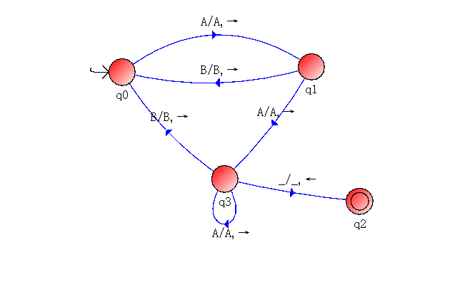

# Turing Machine (TM)

Turing Machine (TM) is the abstract computational machine. 

Given any algorithm, we can construct some TM to simulate that.

 

## Components
- One infinity long tape
  - divided to cells
  - the tape can be moved to left or right.
- Alphabet of input letters
- Alphabet of tape letters
- Some states (finite set)
  - One is start state
  - Some final (accepting) states
- Some transitions
  - `read -> write, direction`
    - `read` is the reading symbol.
    - `write` is the writing symbol.
    - `direction` is the movement of the tap. (Left `L` or Right `R`)
  - `1 -> 0, L`
    - reading `1` and replaced with `0`, then move to the left cell on the tape.

 

## Definition
For a TM *T* :
- `Accept(T)`
  - Finished at final state. 
  - The language accepted by *T*.
- `Reject(T)`
  - Not finished at final state, or crashed.
  - No transition is available for such a symbol. 
- `Loop(T)`
  - The input leads *T* to loop forever.

 

## Example
A TM that accept the language ending with `AA`.

Otherwise, reject.

