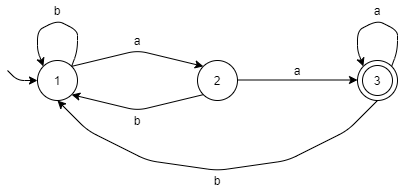

# 正则语言
[](https://github.com/FaDrYL)
[](https://www.fadryl.com/)

**Regular Language**  
正则语言是一种形式语言，可以以[正则表达式](#正则表达式（RegEx）)表示，以及被[有限状态自动机](#有限状态自动机（FA）)识别。

> **Kleene's theorem**  
> 如果一个语言是用以下一种方法定义：
> [正则表达式（RegEx）](#正则表达式（RegEx）), [确定有限状态自动机（DFA）](#确定有限状态自动机（DFA）), [非确定有限状态自动机（NFA）](#非确定有限状态自动机（NFA）) or [广义非确定有限自动机（GNFA）](#广义非确定有限自动机（GNFA）),
> 那么它就能被其它的任意方法定义。  
> 就像:
```
   RegEx ----> NFA   
     ^          |    
     |          v    
    GNFA <---- DFA   
```

<br/>

## 正则表达式（RegEx）
**Regular Expression**  
正则表达式是一个用于模式（规则）匹配的字符串

### 语法
`|`: 或  
`*`: 没有或有更多 (Kleene star)
`?`: 没有或只有一个 (`a?` = `(a|Ɛ)`)  
`[` `]`: 匹配方括号中的任意一个字符 (`[ab]` = `(a|b)`, a到z和1到9中的一个：`[a-z1-9]`).

### 例子
一个字母表为 `{a, b}` 的语言：`b`只存在与两个`a`之间 （如：`aa`，`aba`，`aaaba`）。
> 它是正则语言吗？

是的，因为它能够使用正则表达式来表达。 
比如： `(a(ba)*)*`

<br/>

> 匹配所有数字的正则表达式

比如： `-?[0-9]*[0-9](.[0-9]*[1-9])?`

<br/>

## 有限状态自动机（FA）
**Final Automaton**  
有限状态自动机是一个有多个状态（states）和转移函数（transition，两个状态之间的线）的机器。
其中一个状态是“开始状态（Start state）”，以及多个（或一个）“接受状态（Final state）”。

<br/>

## 确定有限状态自动机（DFA）
**Deterministic Final Automaton**  
DFA是一个FA，且对于每个状态，有关于所有字母表中字母的转移函数。

同时，它不能有空字符 `Ɛ` 的转移函数。

### 例子
一个以 `aa` 结尾的语言（字母表为 `{a,b}`）。（正则表达式：`[ab]*aa` 或 `(a|b)*aa`）



对于状态1、2、3，它们都有对于a、b的转移函数。

<br/>

## 非确定有限状态自动机（NFA）
**Nondeterministic Final Automaton**  
对于NFA中的状态，它能没有或有不只一个某字符的转移函数。
(如：在状态1读取`a`时，能转移到状态2或状态3)

同时，它允许空字符的转移函数。

### 例子
一个以 `aa` 结尾的语言（字母表为 `{a,b}`）。


其中，状态3有个空字符转移函数，以及状态4没有读取`a`或`b`的转移函数。

<br/>

## 广义非确定有限自动机（GNFA）
**Generalized Nondeterministic Finite Automaton**  
GNFA是个用正则表达式来作为转移函数的FA。

### 例子
一个以 `aa` 结尾的语言（字母表为 `{a,b}`）的NFA，并移除状态2。


如果接着移除状态3，并将所有转移函数结合，我们将会得出这个语言的正则表达式。  
(如：`(b|(ab)|(aab)|(aaa*b))*aaa*`，简化后：`(b|a*b)*aaa*`)

<br/>

## 正则语言的泵引理
**Pumping lemma for regular languages**  

泵引理可以用于证明一个语言不是正则语言。

它主要使用反证法来证明。

假设语言 *l* 是正则语言。所以，*l* 能被一些有 *k* 个状态的 FA 识别。  
之后，*l* 中有一个单词 *w*，并且 *|w| >= k*。  

> 因此，这个 FA 中一定存在有一个循环（或者说是，正则表达式中有 kleene star `*`）。所以， *w* 的长度会大于 k-1（一个没有循环的有向图，从开始到结束最多会经过k-1条边）。  

我们选个 *w*（越简单越好）。  
泵引理的规则：  
1. *w* 能被分为 *xyz*。（`w = xyz`）
2. *y* 不能为空字符串。（`|y| > 0` 或 `y != Ɛ`）
3. `|xy| <= k` 
4. `x(y^i)z` 也应该是 *l* 中的单词，其中 `i >= 0`。（`x(y^i)z ∈ l`）

对于所有可能的分法（*w* 选地越简单，分法越少），  
我们都要找到一个特定的数字 *i* 来证明：`x(y^i)z` 不是 *l* 中的单词。

列举完所有的例子后，因为它们都与*规则4*相悖，所以我们可以进行总结：  
因为一开始的假设与结论相悖，所以语言 *l* 不是正则语言。

### 例子
> 语言 `a^nb^n` (如：当 `n = 2` 时，`aabb`) 是正则语言吗?

假设语言 `a^nb^n` 是正则语言，以及 *l* = `a^nb^n`。  
所以，*l* 能被一些有 *k* 个状态的 FA 识别。  
我们使 `w = a^kb^k`，*w* 属于 *l*，并且 `|w| >= k`。  
以及:  
1. `w = xyz`
2. `|y| > 0`
3. `|xy| <= k`  
4. `x(y^i)z ∈ l`，且 `i >= 0`。  

（这个例子有两种分法：`|x|=0, y=a^k` 或 `|x|>0, y=a^(k-|x|), |y|>0`，但我们可以用一个例子来包含它们） 
 
根据我们选的 *w*、*规则2*和*规则3*，我们知道 *y* 只能是由一个或多个字符 *a* 组成， 而不可能包含字符 *b*。  
所以，当 *i* 不为 1 时，*a* 的数量将会少于或多于 *b* 的数量。  
如：i = 0 时, *a* 至少会比 *b* 少一个。 
因此不符合 *l* 的规则，所以 `x(y^0)z` 不是 *l* 中的单词。  

因为泵引理的结果与我们的假设相悖，所以语言 `a^nb^n` 不是正则语言。


